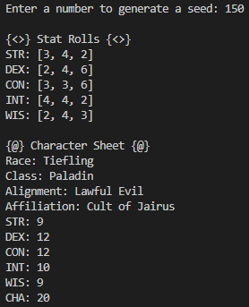

# Fantasy Character Sheet Randomizer 
Simple Python program for generating a randomized fantasy character sheet from a random seed.

## Table of Contents
* [General info](#general-info)
* [How to Run](#how-to-run)

## General Info
This program is the product of an idea I had while messing around with Python's built-in ```random``` module. As a long-time video game enthusiast, I find the concept of utilizing randomly-generated numbers to affect in-game content and functionalities particularly interesting. 

In this case, random numbers (generated by a user-input "seed") are used to roll a theoretical die to determine traditional fantasy character stats such as Strength, Dexterity, Constitution, Intelligence, Wisdom, and Charisma. Random numbers are then used to select various character traits such as race, classing, alignment, and religious affiliation from a data dictionary. 

The results are then compiled and both written to a text file called ```character_sheet.txt``` and printed to the console for the user to view.

**Example**



## How to Run
To run this program, simply download the ```fantasy-character-sheet-randomizer.exe``` file under "Releases" and double-click on the file once the download completes.
